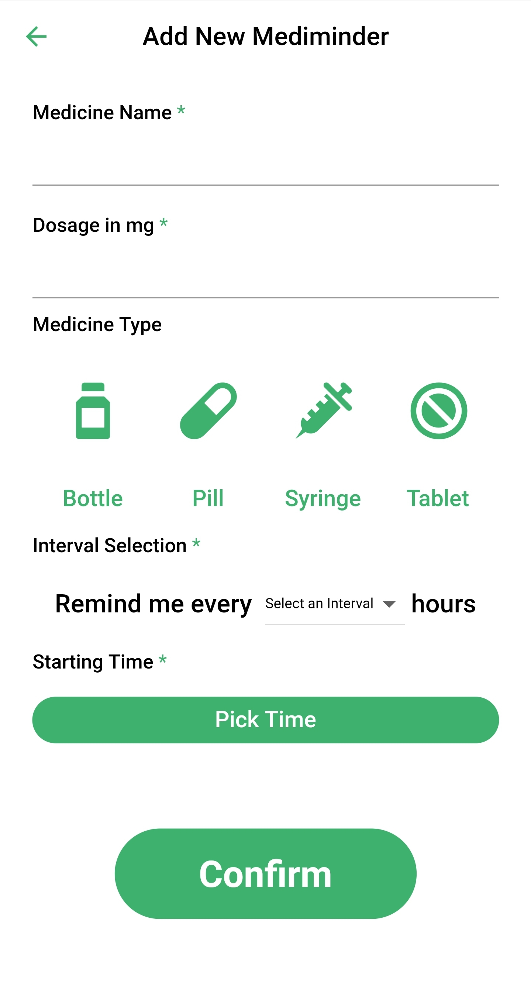
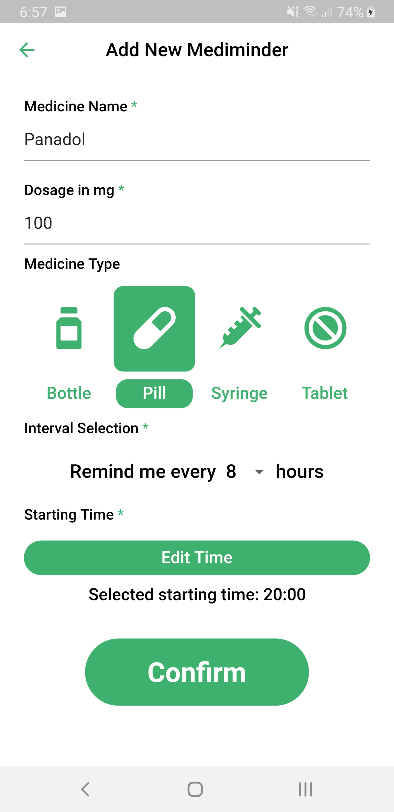
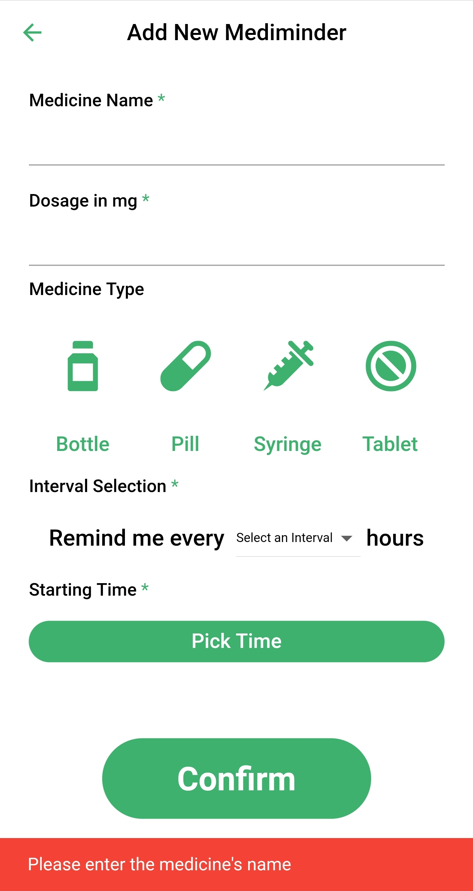
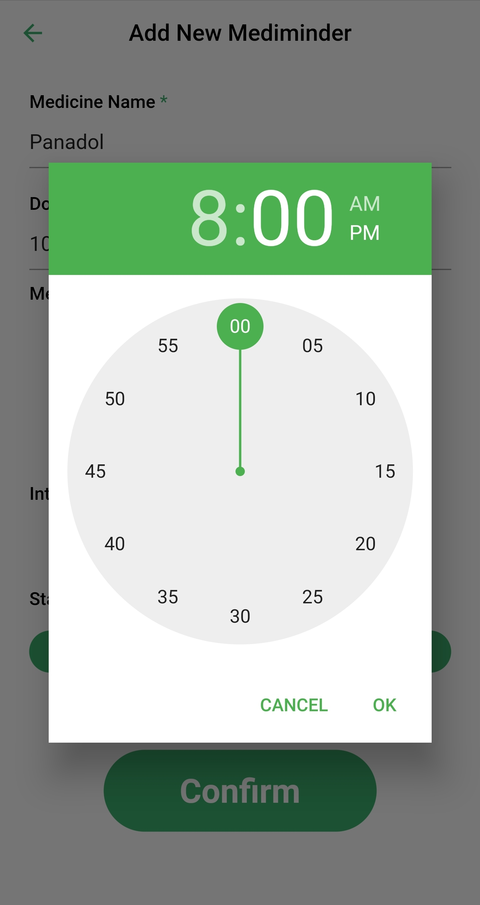
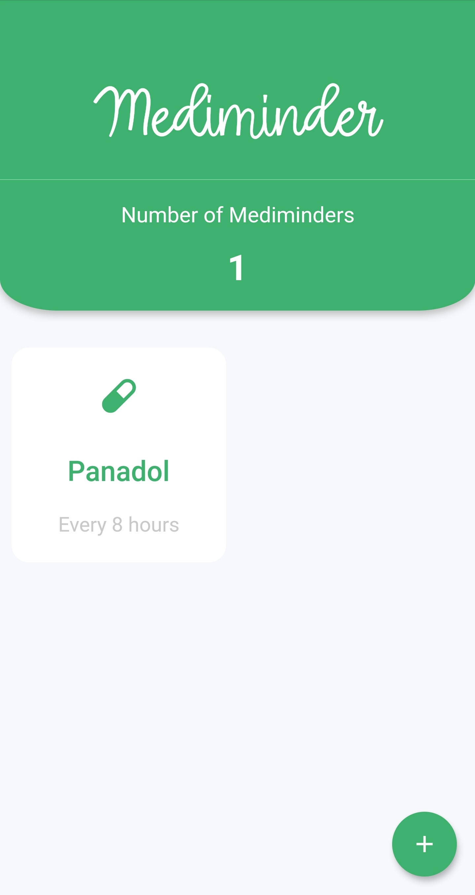
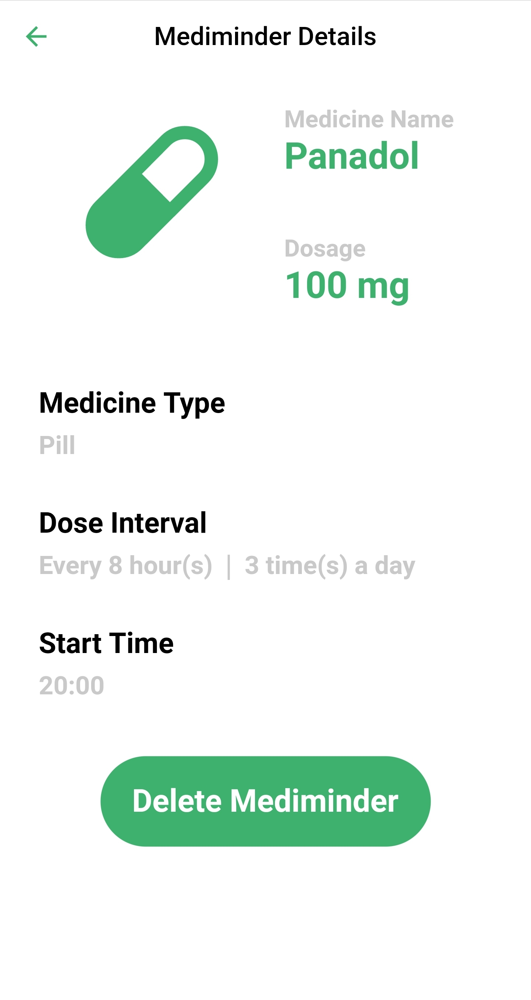

# Medbuddy
Medbuddy is a mobile app used to remind a person about the medicines they have to take. This app is built using Flutter in Dart language.

Project Team Members:
1. <a href="www.github.com/anuragrajanp">Anurag P</a> 
2. <a href="www.github.com/maheshp2002">Mahesh P</a> 
3. <a href="www.github.com/abnormaldil">Dilshith TS</a> 
4. <a href="www.github.com/sarathselvan">Sarath S</a> 
5. <a href="www.github.com/sumasukumaran">Suma M</a> 

<h1 align="center">Medbuddy</h1>

  <strong>An Offline Medicine Reminder</strong>

  Built with Flutter, Provider and BLoC pattern

## Key Features
* __Homepage medicine list__ 
  * Homepage containing all the registered reminders
* __Shared preference data storage__ 
  * Storing medicine objects in shared preference
  * Medicine list retrieval upon application launch
  * JSON encoding and decoding
* __Adding new reminder, details include:__ 
  * Medicine name
  * Dosage in milligrams
  * Medicine icon selection (Optional)
  * Reminder interval selection
  * Starting time using Time Picker
* __Notification reminding__
  * Usage of Local Notifications to display reminders
  * Randomly-generated IDs for each notification
  * Daily reminders with set intervals, based on user preference
* __Registeration error checking__ 
  * Name duplication check
  * Empty/not specified fields check
  * Medicine type is optional
* __Individual medicine detail page__ 
  * In-depth details about each reminder upon tapping
* __Delete a reminder:__ 
  * Erase the specified medicine object from shared preference and list
  * Erase corresponding scheduled notifications 

# Screenshots
<pre>
         

</pre>